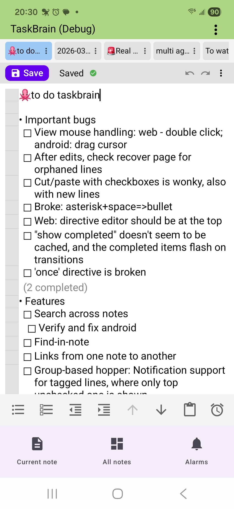
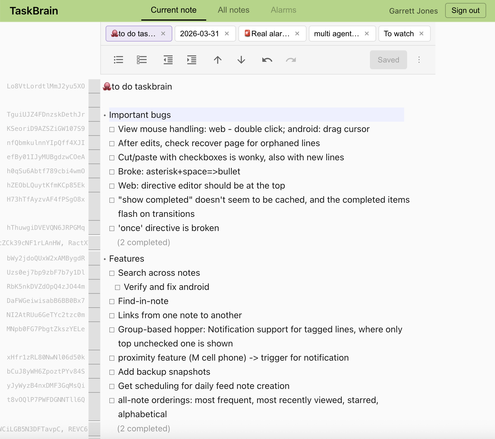

# TaskBrain

TaskBrain is a cross-platform task management app designed to be particularly helpful for people with ADHD. Notes are more than text — they can contain executable directives, scheduled actions, alarms, and inline views of other notes, all powered by a custom DSL called **Mindl**.

Both clients share a Firebase backend (Firestore, Auth) and stay in sync in real time.

## Screenshots

| Android | Web |
|---------|-----|
|  |  |

## Architecture

- **Android** (Kotlin, Jetpack Compose) — primary app in `app/`
- **Web** (TypeScript, React) — in `web/`
- **Backend** — Firebase Firestore with real-time listeners, Google Auth

Data flow follows MVVM: UI screens observe ViewModels, which interact with repositories backed by Firestore. Notes sync across devices via Firestore snapshot listeners.

## Key Features

### Note Editor

- Bullet lists (`*` renders as `•`), checkboxes (`[]` / `[x]`), and tab-based indentation for nesting
- Multi-line gutter selection with drag support
- Undo/redo with intelligent grouping (consecutive typing, structural edits, command operations)
- Move lines up/down preserving logical blocks
- Hide/show completed items per note
- Up to 5 open tabs for quick navigation between notes

### Mindl Directive Language

Notes can contain inline directives in `[...]` brackets that execute on save. Mindl is a mobile-first DSL supporting variables, lambdas, and function composition.

**Directive types:**

| Type | Example | Description |
|------|---------|-------------|
| Computed | `[date]`, `[find(path: "journal/*")]` | Evaluate and display results inline |
| View | `[view(find(tag: "active"))]` | Inline content from other notes with live editing |
| Button | `[button("Archive", [move(to: "archive")])]` | Interactive clickable actions |
| Schedule | `[daily_at("09:00", [refresh])]` | Recurring or one-time automated actions |
| Control | `if`, `later`, `run` | Conditional logic and deferred execution |

Directive results are cached in Firestore with dependency tracking for smart invalidation.

### Alarms and Scheduling

- Four escalation stages: upcoming list, notification, urgent (red screen), audible alarm with snooze
- Recurring alarms with fixed (calendar-anchored) or relative (completion-anchored) recurrence
- Missed-schedule detection with auto-execute (within 15 min) or manual review

### Search

- Full-text search across all notes (name and content)
- Client-side with 300ms debounce — no additional Firestore queries during search
- Results show context snippets with match highlighting, sorted by recent access

## Data Model

Notes are hierarchical: the first line is the parent note's content, and each additional line becomes a child note referenced via `containedNotes`. This enables recursive composition — a note can contain other notes, which themselves contain notes.

- Soft deletion (`state = "deleted"`)
- Stable line identity tracked across edits for preserving alarm and directive associations
- Path-based addressing for DSL lookups (`find(path: "journal/2026-01-25")`)

See `docs/schema.md` for the full Firestore schema.

## Building

### Android

```bash
./gradlew assembleDebug        # Debug APK
./gradlew assembleRelease      # Release APK
./gradlew test                 # Unit tests
./gradlew connectedAndroidTest # Instrumentation tests
```

### Web

```bash
cd web
npm install
npm run dev                    # Development server
npm run build                  # Production build
```

## Tech Stack

| | Android | Web |
|---|---------|-----|
| Language | Kotlin 2.1.0 | TypeScript |
| UI | Jetpack Compose, Material 3 | React |
| Auth | Google Sign-In (Credential Manager) | Google Sign-In |
| Database | Firebase Firestore | Firebase Firestore |
| AI | Firebase AI (Gemini 2.5 Flash) | Firebase AI (Gemini 2.5 Flash) |
